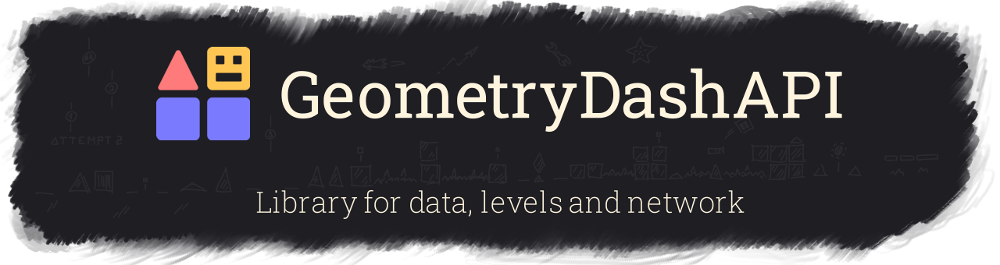

So, **GeometryDashAPI** is the library for edit _everything_ that you imagine  
Amooong things...

## Levels
Edit your own level from the stored data, or download from the server and... edit it!

[learn more](https://github.com/Folleach/GeometryDashAPI/wiki/Levels)

## Stored data
Open `.dat`/`.plist` file for explore your own statistics, creation, downloads, achievements and more 

```cs
var manager = GameManager.LoadFile();
manager.PlayerName = "your name :>"
manager.Save();
```

[learn more](https://github.com/Folleach/GeometryDashAPI/wiki/Game-saves-(wip:-0.2-and-above))

## Network

Don't think about communicates with the server.  
Ready-made methods are at your disposal for

- search
- account
- ... ~~to be honest there are few methods.~~ todo: add a new items when make more methods ;)

```cs
var client = new GameClient();
var user = await client.SearchUserAsync("Folleach");
```

You can even interact with unofficial servers too

[learn more](https://github.com/Folleach/GeometryDashAPI/wiki/Network)

## How to use
1. Install [`GeometryDashAPI`](https://www.nuget.org/packages/GeometryDashAPI/) from Nuget
2. The end. You can use it :)

See [wiki](https://github.com/Folleach/GeometryDashAPI/wiki) for learn more information

## Versions convention

The main version pattern is `0.x.y`  
Where `x` is this some new feature or a big rework  
Where `y` is this a small fix [bug]  

Sometimes there are `-alpha` suffix appears.  
This is means experiment release for include this library to other projects

Major 0 will be change to 1 when library will support most features of game

Every version should contains a tag, with prefix `v`.  
Example: `v1.2.3-alpha`

## Used libraries
| Name        | Link                                                 |
|-------------|------------------------------------------------------|
| SharpZipLib | [GitHub](https://github.com/icsharpcode/SharpZipLib) |
| csFastFloat | [GitHub](https://github.com/CarlVerret/csFastFloat)  |
| UrlBase64   | [GitHub](https://github.com/neosmart/UrlBase64)      |


